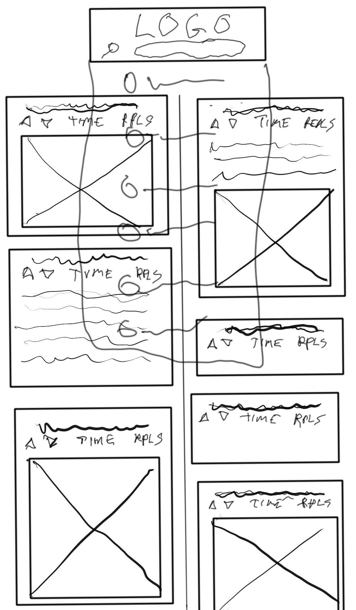
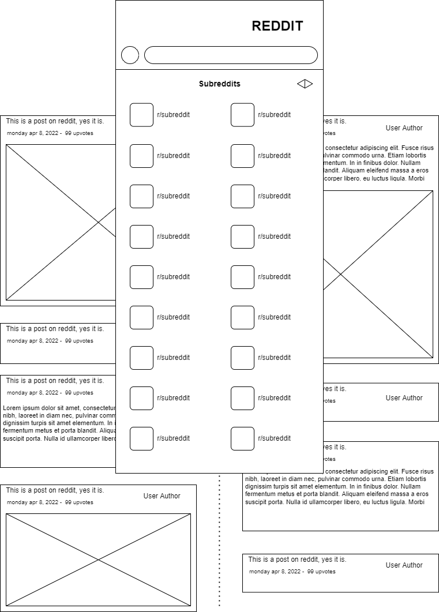

# Reddit App

This takes posts from reddit presents them in a custom interface. I createed it as part of the Full-Stack Engineer path on codecademy.com.

## Features

### Search bar

### Hidden navigation menu

#### Hidden Subreddit descriptions

### Tiled Reddit posts

#### Data handing for multiple types of media

## Technologies used

- React
- Redux
- CSS (using CSS modules)
- React Router
- Jest
- Testing Library
- Git
- GitHub

## Wireframes

===========================================

Second Wireframe made on [draw.io](http://www.draw.io)

## Future Work